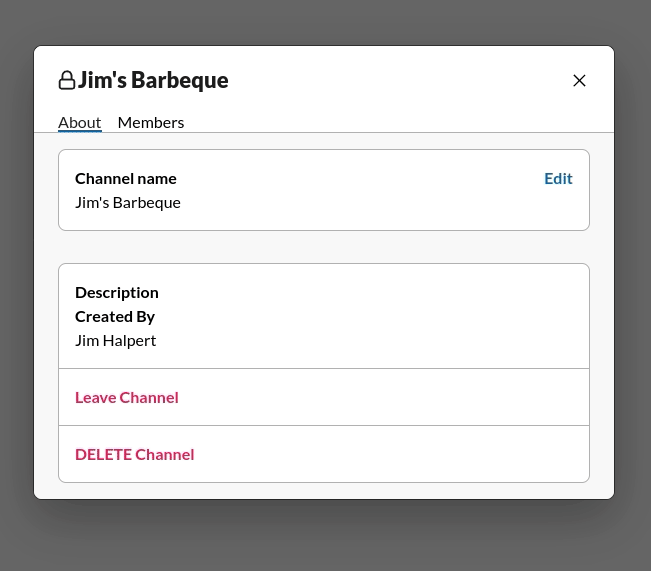
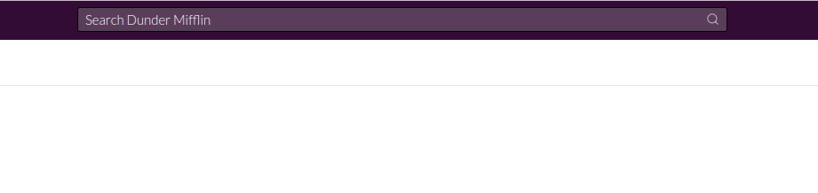

# Relay #

[Relay](https://relay-chatting.herokuapp.com/#/) is a full stack clone of Slack that uses Ruby on Rails, React/Redux, web-sockets (action cable) and psql to provide a live messaging service! Unlike your simple chat app, Relay allows you create multiple workspaces in order for your to separate your different priorities and groups. For even more compartmentalization you can create public or private channels or even groups for up to nine people. You can freely join, leave and edit these channels as well as add new members. With fully functional search it makes it easy to find individuals or channels to accomplish what you would want in a work environment. With websockets, not only do you have live messaging but when you start a new conversation or channel, any online users will instantly have that conversation be added to their sidebar.

## Technologies Used ##
  * Languages: Javascript, Ruby, HTML5, CSS
  * Frontend: React/Redux
  * Backend: Ruby on Rails, Action Cable
  * Database: PostgreSQL
  * Hosting: Heroku

## Features and Implementation ## 
### Workspaces ###
Users can easily switch between their different workspaces to keep up to date on what is happening in their work environments. Each channel and direct message is specific to that workspace to eliminate confusion about who you are talking to and what you are discussing.
> 
### Channels ###
Users are able to create, edit, update and delete (or simply leave) channels. With the channel browser you can see all public channels and join/leave them whenever you please. Private channels however are invite only and leaving a private channel means no reentry (unless you are invited again). The channels description modal also has search functionality to enable you to see who is already in the channel and who you can add.
> 
> 
### Group Messages/Direct Message ###
The message composer allows you to add members to a group message. Adding new members to a group will start a new conversation.
> 

### Edit ###
You can edit and update your old messages (but people will see that you've done this)!
> 
### Search ###
Search for channels or users
> 
### User Interface ###
Interactive user interface to resize the left sidebar, the main messaging window or the profile sidebar. The optional profile sidebar will remain open as you switch between channels.
> 
