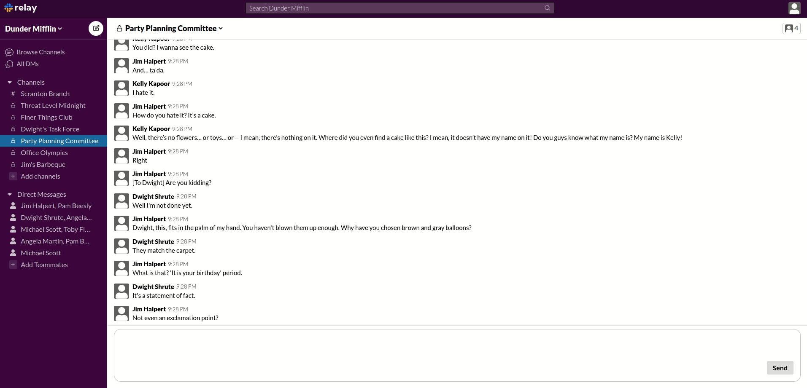

# Relay #

[Relay](https://relay-chatting.herokuapp.com/#/) is a full stack clone of Slack that uses Ruby on Rails, React/Redux, web-sockets (action cable) and psql to provide a live messaging service!

## Technologies Used ##
  * Languages: Javascript, Ruby, HTML5, CSS
  * Frontend: React/Redux
  * Backend: Ruby on Rails, Action Cable
  * Database: PostgreSQL
  * Hosting: Heroku

## Features and Implementation ## 
### Home Page ###

### Workspaces ###

### Channels ###

### Group Messages/Direct Message ###

### Search ###

### User Interface ###

